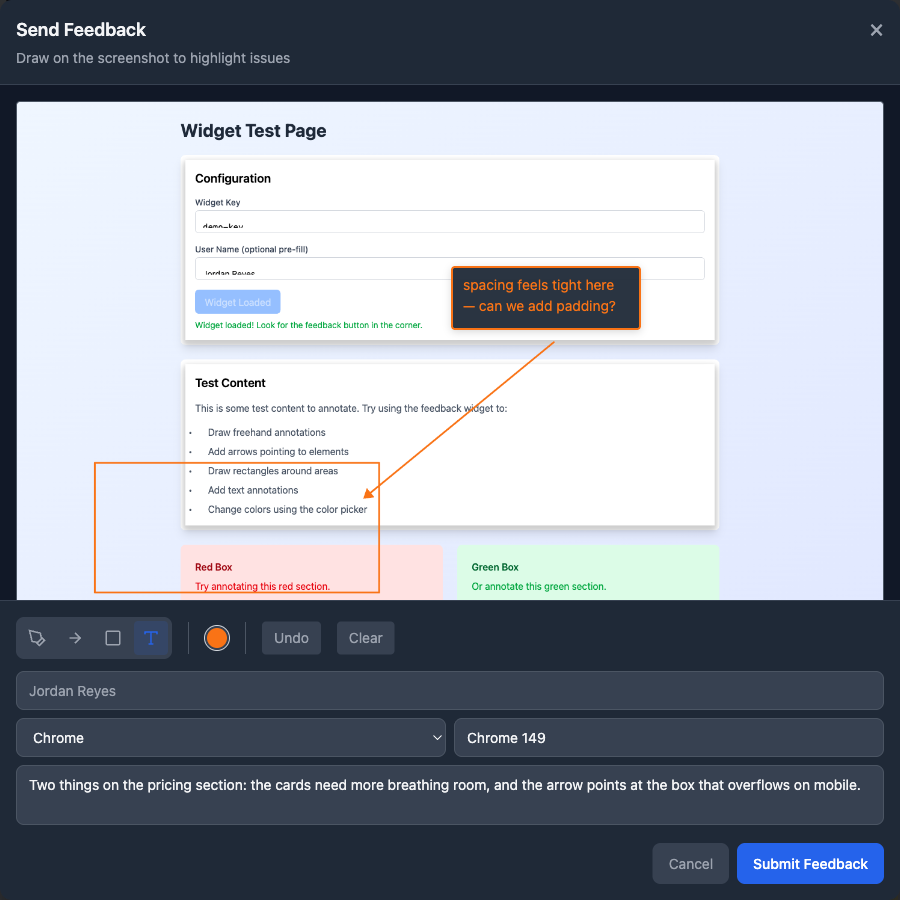

# Browser Comments

> Open-source visual feedback for the web. Clients **mark up the page**; you and
> your coding agents **fix it**.

Testers drop a one-line `<script>` on any site and get a floating feedback
button. They annotate the current screen — pen, arrows, boxes, text notes — and
you get a ticket with the screenshot. Those tickets pipe straight into your
coding agents over **webhooks** or a **poll**. Self-hosted, free, no tracking.

## Deploy your own

One click clones the repo and provisions a free Neon Postgres. You only set a
`BETTER_AUTH_SECRET`; the schema builds itself on first request.

[](https://vercel.com/new/clone?repository-url=https%3A%2F%2Fgithub.com%2Fjomafilms%2Fbrowser-comments&project-name=browser-comments&repository-name=browser-comments&env=BETTER_AUTH_SECRET&envDescription=A%20random%2032%2B%20character%20secret%20that%20signs%20your%20owner-login%20session.%20Generate%20one%20with%3A%20openssl%20rand%20-base64%2032&envLink=https%3A%2F%2Fgithub.com%2Fjomafilms%2Fbrowser-comments%2Fblob%2Fmain%2FRELEASE-NOTES.md&products=%5B%7B%22type%22%3A%22integration%22%2C%22integrationSlug%22%3A%22neon%22%2C%22productSlug%22%3A%22neon%22%2C%22protocol%22%3A%22storage%22%7D%5D)

Then visit `/admin` to create your owner account, add a client, and copy the
widget snippet. Full walkthrough: **[docs/SETUP.md](./docs/SETUP.md)**.

## Docs

- **Live install page** — the `/` route of any deployed instance (e.g. `https://your-instance.vercel.app/`) is the front door, with the Deploy Button and copy-paste snippets.
- **[docs/SETUP.md](./docs/SETUP.md)** — deploy, local dev, env vars, adding the widget.
- **[docs/AGENT-SETUP.md](./docs/AGENT-SETUP.md)** — wire tickets to a coding agent (webhooks, polling, Claude Routine / GitHub Action).
- **[docs/EXTERNAL-DEV-SETUP.md](./docs/EXTERNAL-DEV-SETUP.md)** — tokens, CLI, MCP, direct API.
- **[docs/CORS.md](./docs/CORS.md)** — make cross-origin assets show up in captures.
- **[RELEASE-NOTES.md](./RELEASE-NOTES.md)** — ⚠️ read before upgrading a fork.

## Tech stack

Next.js 15 · React 19 · Tailwind v4 · PostgreSQL (Neon) · Better Auth. The widget
(`public/widget.js`) is generated from `widget-src/` via `npm run build:widget`.

## License

[MIT](./LICENSE) — free to self-host, fork, and read. A paid honor-system
commercial tier may come later; nothing here is gated or metered.
